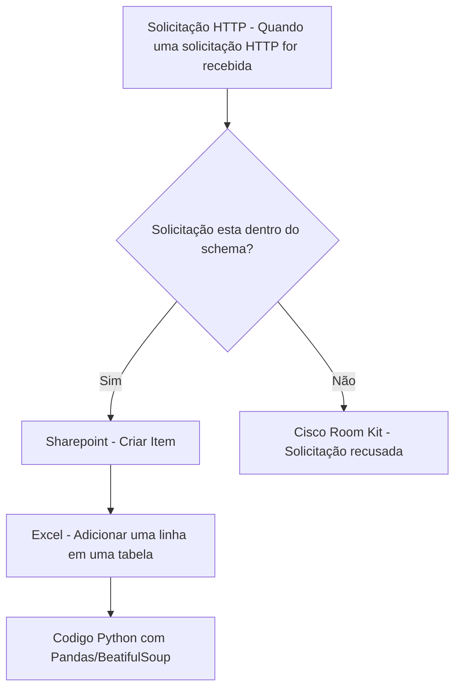
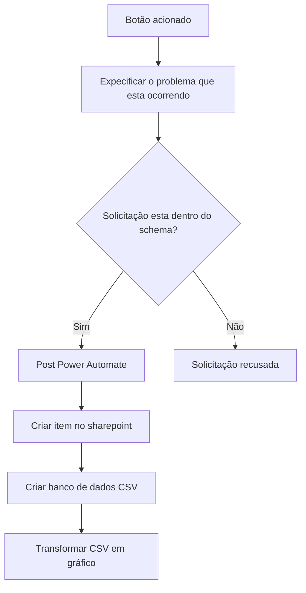

<h1 align="center">Helpme - Room kit</h1>			
<br>
<h4 align="center"> 💻 Em produção 💻 </h4>
<h3 align="center">Botão de ajuda dos equipamentos Cisco room kit</h3>

Tabela de conteúdos
=================
<!--ts-->
   * [Sobre o projeto](#-sobre-o-projeto)
     * [Problemas-resolvidos](#-problemas-resolvidos)
   * [Layout](#-layout)
   * [Como executar o projeto](#-como-executar-o-projeto)
     * [Pré-requisitos](#pré-requisitos)
     * [Funcionalidades](#funcionalidades)
   * [Tecnologias](#-tecnologias)
   * [Autor](#-autor)
   * [Licença](#-licença)
<!--te-->
## 💻 Sobre o projeto 

Descrição:
Helpme é uma API desenvolvida para criar um botão de alerta no sistema de video conferencia Cisco room kit. o sistema criará um botão em seu tablet que, ao ser acionado irá disparar automaticamente um alerta a equipe de suporte técnico, dessa forma você facilitará para que o usuarios de sala de video conferencia tenham uma comunicação rapida e pratica a equipe de suporte.

Tecnologias Utilizadas:
JavaScript: Programado totalmente na linguagem
Xapi: Biblioteca utilizada pelo sistema Room Kit
Webhook: Receptor de API
 #### Fluxo no Power Automate

---

## 🚧 Problemas resolvidos

```bash
#### 1. 📉 Atraso no início de reuniões por falhas técnicas
  Antes: Usuários enfrentam problemas e precisam ligar ou sair da sala para buscar ajuda.
  Com o botão: O alerta é enviado instantaneamente para o suporte técnico.
  🔺 Melhoria estimada: Redução de 70% no tempo médio para iniciar reuniões com falha técnica.
```
```bash
#### 2. 📞 Sobrecarga do suporte com ligações e chamados genéricos
  Antes: Técnicos recebem chamados com informações vagas ou fora de contexto.
  Com o botão: O alerta inclui dados automáticos da sala, horário e tipo de evento, agilizando o diagnóstico.
  🔺 Melhoria estimada: Redução de 50% no tempo de triagem e abertura de chamado.
```
```bash
#### 3. 📉 Falta de visibilidade de problemas em tempo real
  Antes: Problemas eram relatados após o término da reunião ou nem eram reportados.
  Com o botão: O alerta é enviado durante o problema, permitindo resposta imediata ou coleta de logs em tempo real.
  🔺 Melhoria estimada: Aumento de 90% na taxa de detecção de incidentes em tempo real.
```
```bash
#### 4. ⏱️ Tempo de resposta lento do time de TI
  Antes: O suporte só age após o problema ser comunicado (por e-mail, telefone ou WhatsApp).
  Com o botão: Integração com Microsoft Teams, e-mail ou sistema de chamados garante ação em segundos.
🔺 Melhoria estimada: Redução de até 80% no tempo de resposta inicial a incidentes críticos.
```
```bash
#### 5. 🧑‍💼 Insatisfação dos usuários com problemas técnicos recorrentes
Antes: Falhas constantes nas reuniões sem suporte imediato geravam frustração.
Com o botão: Os usuários se sentem amparados e ouvidos, mesmo que o problema não seja resolvido na hora.
🔺 Melhoria estimada: Aumento de até 60% na satisfação do usuário com o suporte técnico.
```
```bash
#### 6. 🧾 Falta de registros automatizados de falhas
Antes: TI não conseguia mapear com precisão quando, onde e como ocorriam as falhas.
Com o botão: Cada alerta pode ser logado em sistemas como Excel, Google Sheets, Power BI, etc.
🔺 Melhoria estimada: 100% de rastreabilidade dos incidentes detectados via botão.
```

## 🎨Layout

-
<p align="center" style="display: flex; align-items: flex-start; justify-content: center;">
 </p>

<p align="center" style="display: flex; align-items: flex-start; justify-content: center;">
 </p>

<p align="center" style="display: flex; align-items: flex-start; justify-content: center;">
 </p>

<p align="center" style="display: flex; align-items: flex-start; justify-content: center;">
 </p>

- 

Componentes Principais:
Room kit (Versões mini, kit, pro e plus): Sistema de video conferencia da Cisco.
Webhook: Irá receber as informações da API e transmitir para o power automate, necessario somente se o ambiente do power plataform for fechado pelo Azure
Power Automate: A versão 1.0 da API foi planejada para ser integrada com o power automate em ambiente fechado, o Power automate será responsavel por receber as informações do webhook e irá transmitir os dados em sua rede.

---

## 🚀 Como executar o projeto

### Pré-requisitos

- Room kit (Versões mini, kit, pro e plus): Sistema de video conferencia da Cisco que contenha tablet.
```bash
✅ Modelos compatíveis da linha Cisco Room Series
📺 Room Kit ✅ Sim
🎥 Room Kit Mini ✅ Sim
🖥️ Room Kit Plus ✅ Sim
🎛️ Room Kit Pro ✅ Sim
🧠 Room Bar (RoomOS) ✅ Sim
🧠 Room Bar Pro ✅ Sim
🧠 Room 70 / Room 55 / Room 75 ✅ Sim (desde que com RoomOS)

Os recursos de macros, painel touch com botões personalizados e integração via xAPI estão disponíveis nos seguintes equipamentos:
  ⚠️ Modelos baseados em Android (ex: Board Pro 55/75 Android) podem ter limitações no suporte a macros e painéis personalizados.

📡 Firmware (RoomOS)
    A versão do RoomOS deve estar atualizada. Recomenda-se: 
    RoomOS 11.x.x.x ou superior
    Modelos mais antigos devem estar no mínimo no RoomOS 10.x
⚙️ Macros habilitadas
    Acesse o terminal da Room Kit (via Web ou SSH)
    Verifique e habilite em:
      Settings > Macros > Enable: true
🔧 Painel com botões personalizados
      Precisa estar configurado pelo Web Portal da Room Kit (IP da interface de admin) Ou carregado via código JSON no endpoint /web/UXConfiguration/Panel
🌍 Servidor de tempo (NTP) sincronizado
    O equipamento precisa de data e hora corretas para:
      Log de eventos
      Segurança em tokens de API
      Sincronização com Power Automate ou serviços externos
```

- Licenciamento do webhook (para ambientes que o power plataform seja fechado)
```bash
🛰️ A Room Kit precisa poder acessar: (se for usar APIs externas)
      URLs HTTP/HTTPS externas (para Power Automate, Zapier, SendGrid, etc)
      DNS funcionando corretamente
```

- Licenciamento do power plataform: Caso seja ambiente aberto você poderá gerar o link diretamente no power automate, excluindo a necessidade do Webhook
```bash
🧾 Webhook de teste ou URL do Power Automate
    Criar gatilho do tipo:
      “Quando uma requisição HTTP for recebida” no Power Automate ou usar uma API pública temporária (Webhook.site, RequestBin, etc)
```

- Configurações de rede
```bash
🌍 VLAN da sala deve garantir:
        QoS (DSCP 34/46, Trust COS/DSCP)
        Sem inspeção SSL/Proxy nos domínios da Cisco
        MTU correta (1500 bytes ou conforme rede)
        Sem bloqueios de porta: 443 (HTTPS), 123 (NTP), 80 (fallback)
 🧑‍💻 Acesso SSH habilitado
      Usado para testes avançados e depuração
      Habilitar via Web UI → Settings > Security > SSH: Enabled
```
---
  
<b>Instalação:</b>

- Copie o código disponivel em helpme.json
- acesse seu equipamento room kit via IP
- acesse a pagina macros > nova macro
- Cole o código da API e salve a macro
- Vá em layout > Criar botão > ID = nome da macro > Personalize o botão de acordo com o seu desejo

#### Funcionalidades

```bash

Solicitar ajuda:
  Quando o botão for acionado a API irá coletar as informações da sala salvas previamente e transferir para o power automate via webhook, iniciando o fluxo que irá destinar o contato com a equipe técnica.

```

### 🧑‍💻Guia do Usuário:



## 🛠 Tecnologias

As seguintes tecnologias foram usadas na construção do projeto:

-   **[JavaScript](https://developer.mozilla.org/pt-BR/docs/Web/JavaScript)**
-   **[XAPI](https://xapi.com/)**
-   **[Cisco Room Kit](https://www.cisco.com/c/en/us/support/collaboration-endpoints/spark-room-kit/model.html)**
-   **[Webhook](https://webhook.site/)**
-   **[Power Automate](https://www.microsoft.com/pt-br/power-platform/products/power-automate)**
---

## 🦸🏻‍♂️ Autor

 <br>
  <sub><b><p>Christopher Silva</p></b></sub></a>
 <br />

[](https://www.linkedin.com/in/chris-f-silva/) 
[](mailto:chrisspfc.silva@gmail.com)

---

## 📝 Licença

Este projeto está licenciado sob a licença MIT - veja o arquivo LICENSE para mais detalhes. [MIT](./LICENSE)

Feito por: Christopher Silva
</div>
